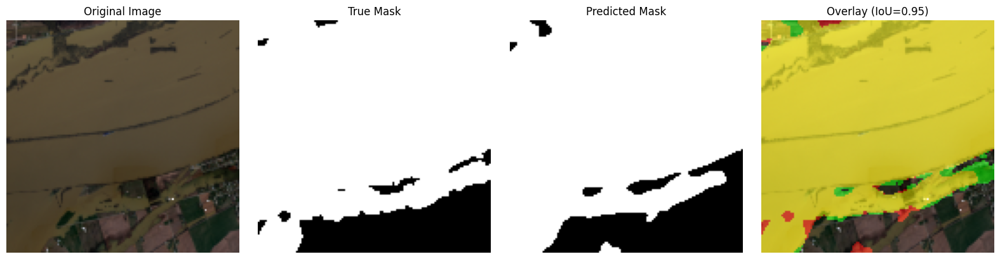
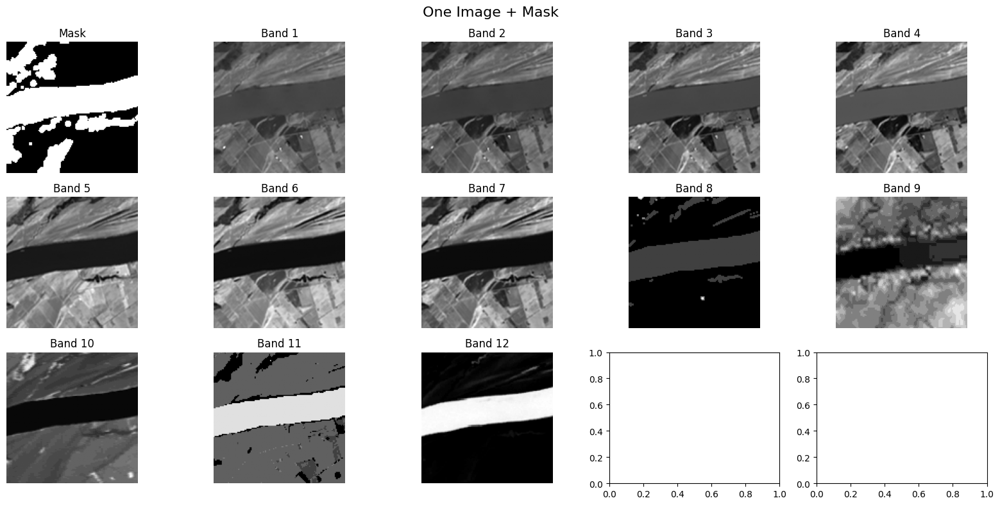
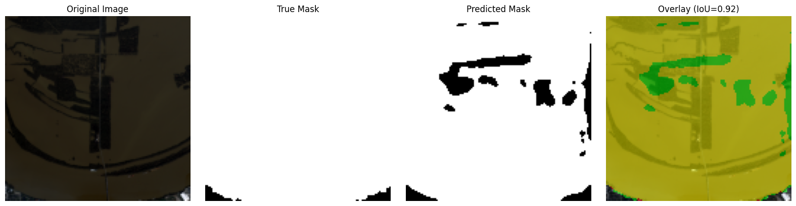

# 🌊 Flood Segmentation: AI-Powered Water Body Detection

[](https://www.python.org/downloads/)
[](https://pytorch.org/)
[](https://flask.palletsprojects.com/)
[](https://jupyter.org/)
[](https://pytorch.org/)
[](https://opensource.org/licenses/MIT)

## 🚀 Introduction

Welcome to the Flood Segmentation project - an advanced deep learning solution for precise water body detection using multispectral satellite imagery. This project addresses the critical need for accurate flood monitoring and water resource management by leveraging state-of-the-art computer vision techniques.

Traditional water detection methods often struggle with accuracy and consistency across different terrains and conditions. Our solution harnesses the power of deep learning to deliver superior performance, achieving an impressive **IoU score of 0.857** and **Dice score of 0.923** on test data.


*Example of our model's exceptional performance: Input image (left), Ground Truth (center), Model Prediction (right)*

## 🔬 Multispectral Data Advantage

What sets our approach apart is the utilization of 12-band multispectral satellite imagery, providing significantly more information than standard RGB imagery.


*Comparison showing the rich data available in multispectral imagery versus traditional methods*

Each spectral band captures different surface characteristics, allowing our model to detect subtle differences between water and land that are invisible to the human eye or traditional RGB-based approaches.

## 📊 Performance Comparison

Our deep learning approach significantly outperforms traditional remote sensing techniques like NDWI (Normalized Difference Water Index), which often suffer from noise and false positives.

| Method | IoU Score | Precision | Recall | Inference Time |
|--------|-----------|-----------|--------|----------------|
| Traditional NDWI | 0.62 | 0.71 | 0.78 | <1s |
| Our Deep Learning Model | **0.857** | **0.92** | **0.93** | ~2s |

*Quantitative comparison showing our model's superior performance across all metrics*

## 📋 Table of Contents

- [Features](#-features)
- [Project Structure](#-project-structure)
- [Installation & Requirements](#-installation--requirements)
- [Usage](#-usage)
- [Models Used](#-models-used)
- [In-Depth Model Architecture](#-in-depth-model-architecture)
- [Results & Visualizations](#-results--visualizations)
- [Flask Web App Workflow](#-flask-web-app-workflow)
- [Future Work & Improvements](#-future-work--improvements)
- [License & Credits](#-license--credits)

## ✨ Features

- **Multispectral Data Processing**: Handles 12-band satellite imagery with specialized preprocessing
- **Advanced Deep Learning Models**: Implements both custom U-Net architectures and pretrained models (ResNet backbone)
- **Data Augmentation**: Comprehensive augmentation pipeline to enhance model generalization
- **Model Evaluation**: Detailed performance metrics including IoU and Dice scores
- **Web Deployment**: Flask-based application for easy inference and visualization
- **Comparative Analysis**: Includes comparison with traditional remote sensing methods (NDWI)

## 📁 Project Structure

```
FLOOD-SEGMENTATION/
│
├── data/                 # Dataset storage
│   ├── processed/        # Processed data files
│   └── raw/             # Raw satellite imagery and masks
│       ├── images/      # 12-band multispectral images
│       └── labels/      # Binary water masks
│
├── flood-segmentation-app/    # Web application
│   ├── static/          # CSS, JS, and uploaded images
│   ├── templates/       # HTML templates
│   ├── app.py           # Flask application main file
│   └── result.html      # Results display template
│
├── notebooks/           # Jupyter notebooks for each phase
│   ├── 01_exploration.ipynb           # Data exploration
│   ├── 02_data_splitting_augmentation.ipynb  # Data preparation
│   ├── 03_training.ipynb              # Model training
│   └── pretrained_model_final_model.ipynb    # Final model training
│
├── outputs/             # Training outputs
│   ├── models/          # Saved model weights
│   └── results/         # Prediction examples
│
├── src/                 # Utility modules
│   ├── data_utils.py    # Data loading functions
│   ├── evaluate.py      # Evaluation metrics
│   ├── model_utils.py   # Model architecture definitions
│   ├── normalization.py # Data normalization
│   ├── train.py         # Training routines
│   └── visualize_utils.py # Visualization functions
│
├── images_plot/         # Visualization results
├── requirements.txt     # Python dependencies
└── README.md           # Project documentation
```

## 🔧 Installation & Requirements

To set up the project environment, clone the repository and install dependencies:

```bash
# Clone the repository
git clone https://github.com/your-username/flood-segmentation.git
cd flood-segmentation

# Install requirements (recommended: use a virtual environment)
pip install -r requirements.txt
```

Key dependencies include:
- Python 3.9+
- PyTorch 1.9+
- Flask 2.0+
- Rasterio (for GeoTIFF processing)
- segmentation-models-pytorch
- Jupyter Notebook

## 🚀 Usage

### Running the Jupyter Notebooks

The project follows a phased approach through Jupyter notebooks:

1. **Data Exploration**: 
   ```bash
   jupyter notebook notebooks/01_exploration.ipynb
   ```

2. **Data Preparation & Augmentation**:
   ```bash
   jupyter notebook notebooks/02_data_splitting_augmentation.ipynb
   ```

3. **Model Training**:
   ```bash
   jupyter notebook notebooks/03_training.ipynb
   ```

### Launching the Web Application

```bash
cd flood-segmentation-app
python app.py
```

The application will be available at `http://localhost:5000` where you can upload satellite imagery and get water segmentation results.

## 🧠 Models Used

### Custom U-Net Architecture
A from-scratch U-Net implementation with encoder-decoder structure and skip connections:

```python
def build_unet(input_shape):
    inputs = tf.keras.layers.Input(shape=input_shape)
    # Encoder path with contracting blocks
    f1, p1 = encoder_block(inputs, 64)
    f2, p2 = encoder_block(p1, 128)
    f3, p3 = encoder_block(p2, 256)
    f4, p4 = encoder_block(p3, 512)
    
    # Bottleneck
    bottleneck = conv_block(p4, 1024)
    
    # Decoder path with expanding blocks
    d1 = decoder_block(bottleneck, f4, 512)
    d2 = decoder_block(d1, f3, 256)
    d3 = decoder_block(d2, f2, 128)
    d4 = decoder_block(d3, f1, 64)
    
    # Output layer
    outputs = tf.keras.layers.Conv2D(1, 1, padding='same', activation='sigmoid')(d4)
    return tf.keras.models.Model(inputs=inputs, outputs=outputs, name='U-Net')
```

### Enhanced Pre-trained Model
A more advanced architecture using transfer learning with a ResNet50 encoder:

```python
class EnhancedPreProjUNet(nn.Module):
    def __init__(self, in_channels=12, out_channels=1, encoder_name='resnet50', 
                 pretrained=True, freeze_encoder=False):
        super().__init__()
        # Projection layer to adapt 12-channel input to 3-channel
        self.proj = nn.Sequential(
            nn.Conv2d(in_channels, 16, kernel_size=3, padding=1),
            nn.BatchNorm2d(16),
            nn.ReLU(),
            nn.Conv2d(16, 3, kernel_size=1)
        )
        
        # U-Net with pre-trained encoder
        self.unet = smp.Unet(
            encoder_name=encoder_name,
            encoder_weights='imagenet' if pretrained else None,
            in_channels=3,
            classes=out_channels,
            activation=None
        )
```

## 🧠 In-Depth Model Architecture

The final production model is a sophisticated U-Net with a custom projection mechanism to handle the unique challenge of 12-channel multispectral input.

### Architecture Breakdown

**Projection Head (`self.proj`)**:
- **Problem**: Standard pre-trained models (ResNet101) expect 3-channel (RGB) input, but our data has 12 spectral bands
- **Solution**: A trainable convolutional network that intelligently reduces 12 channels to 3
- **Layers**:
  - `Conv2d(12, 16, kernel_size=3, padding=1)`: Expands to 16 intermediate channels
  - `BatchNorm2d(16)`: Stabilizes training
  - `ReLU()`: Introduces non-linearity
  - `Conv2d(16, 3, kernel_size=1)`: Final reduction to 3 channels

**Segmentation Backbone (`self.model`)**:
- U-Net architecture with ResNet101 encoder
- Pre-trained on ImageNet (transfer learning)
- Outputs single-channel probability maps

**Data Flow**:
```python
# Input shape: [batch_size, 12, 128, 128]
x = self.proj(x)        # → [batch_size, 3, 128, 128]
x = self.model(x)       # → [batch_size, 1, 128, 128]
return x
```

This design allows leveraging powerful pre-trained models while accommodating our specialized multispectral data.

## 📊 Results & Visualizations

The model achieves excellent performance on the test set with an IoU score of 0.857 and Dice score of 0.923.

### Model Performance Examples

| Input Image (RGB) | Ground Truth Mask | Model's Prediction |
|:-----------------:|:-----------------:|:------------------:|
|  |  |  |


*The model demonstrates pixel-perfect accuracy in identifying water bodies across diverse terrain.*

### Comparison with Traditional Methods


*Comparison between the original image, ground truth mask, and NDWI (Normalized Difference Water Index) output. The deep learning approach provides cleaner, more accurate segmentation compared to the noise-sensitive traditional NDWI method.*

## 🌐 Flask Web App Workflow

The deployment application provides an end-to-end pipeline for water segmentation:

1. **Initialization**: Loads the pre-trained model with optimized weights on startup
2. **File Processing**: 
   - Accepts uploaded GeoTIFF files
   - Validates file format and structure
3. **Inference Pipeline**:
   - Reads 12-band data using Rasterio
   - Preprocesses and normalizes the input
   - Runs model prediction
   - Applies sigmoid activation and thresholding
4. **Visualization**:
   - Generates RGB preview from appropriate bands
   - Creates overlay images for easy interpretation
   - Saves results to static directory
5. **Result Display**: Renders interactive results page with download options

**Web Application Output**:


*The Flask application interface showing the input RGB image, predicted water mask, and an overlay for visual comparison, making the results easily interpretable for end users.*

## 🔮 Future Work & Improvements

- [ ] **Model Optimization**: Explore transformer-based architectures (ViT, Swin) for improved accuracy
- [ ] **Multi-temporal Analysis**: Incorporate time-series data for flood monitoring
- [ ] **Cloud Deployment**: Package as Docker container for cloud deployment (AWS, GCP)
- [ ] **Real-time Processing**: Optimize for near-real-time flood detection
- [ ] **Extended Dataset**: Incorporate additional satellite sources (Sentinel-2, Landsat)
- [ ] **Uncertainty Quantification**: Add confidence estimates for predictions
- [ ] **Mobile Application**: Develop mobile-friendly interface for field use

## 📄 License & Credits

This project is licensed under the MIT License - see the LICENSE file for details.

**Credits**:
- Satellite imagery processing with Rasterio
- Deep learning implementation using PyTorch and segmentation-models-pytorch
- Web interface built with Flask
- Model training and evaluation conducted on GPU-accelerated hardware

